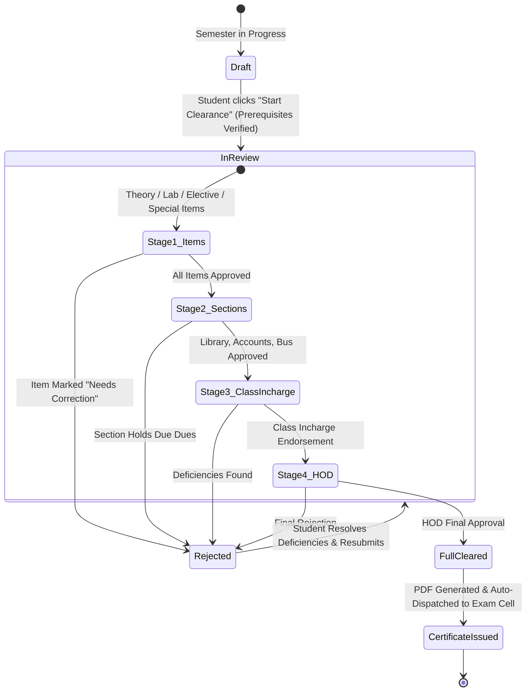
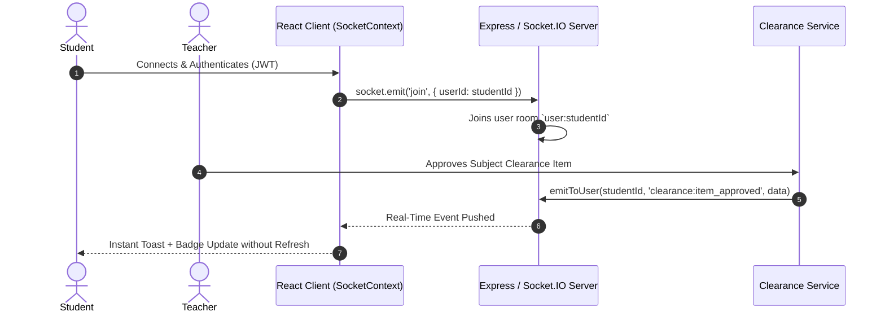

# 🎓 ClearMate: AI-Driven Student Clearance Management System
### *The Complete "One-Read" Architecture, Technology, Concept & Workflow Guide*

---

## 📑 Table of Contents
1. [Executive Overview](#1-executive-overview)
2. [Full Technology Stack](#2-full-technology-stack)
3. [Core Concepts & Architectural Patterns](#3-core-concepts--architectural-patterns)
4. [Step-by-Step System Lifecycle (The 4 Phases)](#4-step-by-step-system-lifecycle-the-4-phases)
5. [Role-Based Access Control (RBAC) Matrix](#5-role-based-access-control-rbac-matrix)
6. [Data Models & Database Schema](#6-data-models--database-schema)
7. [AI & Predictive Intelligence Features](#7-ai--predictive-intelligence-features)
8. [Real-Time WebSocket Architecture](#8-real-time-websocket-architecture)
9. [Security, Sanitation & Auditing](#9-security-sanitation--auditing)
10. [Complete API Route Map](#10-complete-api-route-map)
11. [Setup, Execution & Environment Configuration](#11-setup-execution--environment-configuration)

---

## 1. Executive Overview

**ClearMate** is a full-stack, enterprise-grade academic workflow and clearance management platform. In traditional universities and colleges, graduating or semester-end students undergo a manual, error-prone, paper-intensive clearance process across dozens of departments (teachers, labs, library, accounts, transport, class in-charges, HODs). 

ClearMate digitizes and automates this entire pipeline into a real-time, AI-assisted, multi-stage approval system.

### Key Capabilities:
* **Automated Prerequisite Checks**: Prevents students from requesting clearance until all continuous assessments and lab assignments are verified.
* **4-Stage Clearance Approval Pipeline**: Sequential/parallel multi-department review with rejection reasons, notes, and instant resubmission handling.
* **Predictive Student Risk Analytics**: Machine learning/scoring heuristic that identifies students at risk of missing clearance deadlines before the semester ends.
* **Context-Aware AI Clearance Advisor**: Anthropic Claude-powered virtual assistant with live access to student database records.
* **Instant Digital Certificate Generation & Exam Cell Dispatch**: Generates tamper-evident digital certificates and automatically notifies the examination cell.
* **Live WebSocket Real-time Notifications**: Instant updates for reviews, approvals, rejections, and broadcasts.

---

## 2. Full Technology Stack

```
+-------------------------------------------------------------------------+
|                              FRONTEND                                   |
|   React 19  *  Vite 6  *  TailwindCSS 3.4  *  Socket.io-Client  *  Axios |
+-------------------------------------------------------------------------+
                                    |  REST / WebSockets (JWT Auth)
                                    v
+-------------------------------------------------------------------------+
|                               BACKEND                                   |
|    Node.js  *  Express 5.x  *  Socket.IO 4.8  *  Winston  *  Nodemailer  |
+-------------------------------------------------------------------------+
            |                                         |
            v                                         v
+------------------------+               +--------------------------------+
|        DATABASE        |               |         EXTERNAL / AI          |
|  MongoDB & Mongoose    |               |  Anthropic Claude API (AI Bot) |
| (Atlas / In-Memory DB) |               |  SMTP Mail (Email Dispatch)    |
+------------------------+               +--------------------------------+
```

### 2.1. Frontend Technologies
| Technology | Version | Purpose & Usage in ClearMate |
| :--- | :--- | :--- |
| **React** | `v19.2.7` | UI library for declarative, reactive, and modular single-page application (SPA) views. |
| **Vite** | `v6.4.0` | Ultra-fast development server and production bundler with ESM Hot Module Replacement (HMR). |
| **TailwindCSS** | `v3.4.19` | Modern utility-first CSS framework configuring custom color palettes, glassmorphism, and responsive layouts. |
| **React Router DOM** | `v7.18.1` | Client-side routing, protected route wrappers, and role-based route gating. |
| **Axios** | `v1.18.1` | Promise-based HTTP client with centralized interceptors for JWT cookies, Bearer tokens, and error handling. |
| **Socket.io-client** | `v4.8.3` | Persistent bidirectional WebSocket connection for live notifications and status alerts. |
| **React Hot Toast** | `v2.6.0` | Non-intrusive floating toast notifications for user actions and live events. |
| **React Icons** | `v5.7.0` | Consistent iconography across dashboards, sidebars, and status badges. |
| **XLSX (SheetJS)** | `v0.18.5` | In-browser parsing and generation of Excel/CSV files for bulk student roster uploads and clearance export. |

### 2.2. Backend Technologies
| Technology | Version | Purpose & Usage in ClearMate |
| :--- | :--- | :--- |
| **Node.js** | `v18+` | Server-side JavaScript runtime. |
| **Express** | `v5.2.1` | Web application framework handling routing, REST APIs, and middleware orchestration. |
| **MongoDB / Mongoose** | `v9.7.4` | NoSQL document database with strict Mongoose schema validation, indexes, and population hooks. |
| **MongoDB Memory Server**| `v11.2.0` | Zero-configuration fallback in-memory database enabling out-of-the-box local execution without local MongoDB installation. |
| **Socket.IO** | `v4.8.3` | Real-time WebSocket server with user-specific and role-specific event rooms. |
| **Nodemailer** | `v9.0.5` | Transporter for dispatching clearance completion certificates, password resets, and reminder emails. |
| **Winston & Morgan** | `v3.19.0` | Enterprise structured logging with timestamped logs, console coloring, and HTTP access auditing. |

### 2.3. Security & Validation Suite
| Package | Purpose |
| :--- | :--- |
| **jsonwebtoken (JWT)** | Stateless authentication using cryptographically signed access tokens stored in `httpOnly` cookies and authorization headers. |
| **bcryptjs** | Salted password hashing (10 rounds) protecting credentials against rainbow-table attacks. |
| **Joi** | Request payload schema validation preventing invalid or malformed data before hitting controllers. |
| **helmet** | Sets secure HTTP response headers (HSTS, CSP, X-Frame-Options) to safeguard against common web attacks. |
| **express-mongo-sanitize** | Strips out prohibited characters (e.g., `$`, `.`) to prevent NoSQL Query Injection. |
| **xss** | Sanitizes user-submitted strings to neutralize Cross-Site Scripting (XSS) attacks. |
| **express-rate-limit** | Prevents brute-force attacks by rate-limiting authentication attempts and API bursts. |

---

## 3. Core Concepts & Architectural Patterns

### 3.1. MVC + Services Layered Architecture
ClearMate strictly enforces the **Model-View-Controller-Service** pattern to maintain separation of concerns:
```
[ Incoming Request ]
        │
        ▼
[ Route Definitions ] ───▶ [ Middleware (Auth, RBAC, Rate-Limit, Joi Validation) ]
                                    │
                                    ▼
                          [ Controller Layer ] (Extracts params, shapes JSON response)
                                    │
                                    ▼
                           [ Service Layer ] (All business logic, multi-model orchestrations)
                                    │
                                    ▼
                         [ Data Access / Models ] (Mongoose schemas, indexes, DB hooks)
```

1. **Routes (`server/src/routes/`)**: Map URI endpoints to controllers and bind middleware.
2. **Controllers (`server/src/controllers/`)**: Handle HTTP requests/responses, status codes, and input extraction.
3. **Services (`server/src/services/`)**: Encapsulate all business rules, calculations, cross-collection transactions, and external API calls.
4. **Models (`server/src/models/`)**: Define database schemas, virtual properties, indexes, and document hooks.
5. **Validators (`server/src/validators/`)**: Validate request structures using Joi schemas before processing.

---

### 3.2. State Machine Pipeline for Clearance
The clearance approval process behaves as a finite state machine:



---

## 4. Step-by-Step System Lifecycle (The 4 Phases)

The entire academic clearance cycle operates across 4 systematic phases:

```
+------------------------------------------------------------------------------------+
|  PHASE 1: Admin Academic Setup                                                     |
|  * Setup Programs & Semesters                                                      |
|  * Configure Clearance Items (Theory, Labs, Electives, Special)                    |
|  * Create Batches (A, B, C) & Assign Lab Teachers                                  |
|  * CSV Roster Import for Students                                                  |
|  * Setup Continuous Submissions (Assignments, Deadlines)                           |
+------------------------------------------------------------------------------------+
                                         │
                                         ▼
+------------------------------------------------------------------------------------+
|  PHASE 2: Throughout the Semester                                                  |
|  * Student Submissions Dashboard (Track Deadlines & Work)                          |
|  * Real-Time Deadline Reminders & Socket Alerts                                    |
|  * Continuous Teacher Verification & Grading                                       |
|  * Predictive Risk Engine Flags At-Risk Students Early                             |
+------------------------------------------------------------------------------------+
                                         │
                                         ▼
+------------------------------------------------------------------------------------+
|  PHASE 3: End-of-Semester Multi-Stage Clearance Pipeline                           |
|  * Student Initiates Clearance Check                                               |
|  * Automated Prerequisite Engine Validates 100% Submission Verification            |
|  * Stage 1: Theory/Lab/Elective Teacher Reviews                                    |
|  * Stage 2: Section Reviews (Library, Accounts/Fee, Bus/Transport)                 |
|  * Stage 3: Class Incharge Consolidation & Class Review                            |
|  * Stage 4: Head of Department (HOD) Final Departmental Approval                   |
+------------------------------------------------------------------------------------+
                                         │
                                         ▼
+------------------------------------------------------------------------------------+
|  PHASE 4: Completion, Certificate Generation & Exam Dispatch                       |
|  * Request transitions to 'FULL CLEARED'                                           |
|  * Digital Tamper-Evident Certificate Generated                                    |
|  * Automated Email Dispatch to University Examination Cell                         |
|  * Student Portal Unlocks PDF Download & QR Verification                          |
+------------------------------------------------------------------------------------+
```

### 🔹 Phase 1 — Admin Setup
1. **Program Setup**: Admin creates departments/programs (e.g., *B.Tech Artificial Intelligence & Data Science*, *Computer Science & Engineering*).
2. **Semester Setup**: Creates active semester instances (e.g., *Semester 5, 2024-25 ODD*).
3. **Clearance Rules Definition**: Defines clearance criteria:
   * **Theory Items**: Linked to primary subject teachers.
   * **Lab Items**: Linked to specific batches and lab in-charges.
   * **Elective Items**: Dynamic pool chosen by or assigned to students.
   * **Special Items / Dues**: Project work, seminar clearances, etc.
4. **Batch & Section Partitioning**: Creates practical lab batches (`Batch A`, `Batch B`, `Batch C`) and assigns faculty.
5. **Student Roster Upload**: Bulk CSV/Excel importer creates student profiles with roll numbers, assigned batches, and electives.
6. **Submission Items Config**: Establishes continuous evaluation tasks (e.g., Assignment 1, Lab Record 3, Term Project Report) with strict deadlines.

---

### 🔹 Phase 2 — Throughout the Semester
1. **Student Dashboard**: Students see live counters of pending vs. completed submissions and upcoming deadlines.
2. **Work Submission**: Students upload file URLs, links, or notes for required submissions.
3. **Teacher Verification**: Teachers review submissions with options to `Approve`, `Reject`, or `Request Resubmission` with notes.
4. **Predictive Risk Monitoring**: The backend `risk.service.js` continuously computes student completion scores, flagging students falling behind so advisors can intervene.

---

### 🔹 Phase 3 — End-of-Semester Clearance Pipeline
1. **Clearance Initiation**: When semester ends, the student clicks **"Start Clearance"**.
2. **Prerequisite Check**: The system validates if all prerequisite continuous submissions are approved. If any submission is pending or rejected, clearance is blocked with a detailed checklist of what is missing.
3. **Auto-Generation of Clearance Records**: Once prerequisites pass, the system automatically spawns:
   * `ItemClearance` records for each theory, lab, elective, and special item.
   * `SectionClearance` records for departmental units (Library, Accounts, Bus, Student Section).
4. **Multi-Stage Approval Pipeline**:
   * **Stage 1 (Item Clearance)**: Teachers review each student's subject/lab status.
   * **Stage 2 (Section Clearance)**: Department heads (Library, Accounts, Bus) verify zero dues or books returned.
   * **Stage 3 (Class Incharge Clearance)**: Class in-charge performs high-level validation of student standing.
   * **Stage 4 (HOD Clearance)**: Head of Department provides the final sign-off.

---

### 🔹 Phase 4 — Output & Certificate Generation
1. **Completion Status**: On HOD approval, the clearance request is permanently stamped as `completed` / `FULL CLEARED`.
2. **Certificate Generation**: `certificate.service.js` creates structured certificate data with a unique cryptographic verification number (`CLR-XXXXXX-XXXX`).
3. **Exam Cell Dispatch**: The system triggers `email.service.js` to dispatch the verified clearance record to the University Examination Cell.
4. **Student Certificate Access**: The student dashboard renders the verifiable certificate with print/PDF export and audit trail signatures.

---

## 5. Role-Based Access Control (RBAC) Matrix

ClearMate provides granular access control across **9 specialized roles**:

| Role Name | Scope & Permissions |
| :--- | :--- |
| **`super_admin`** | Full root control over all programs, database resets, global system configuration, and admin management. |
| **`admin`** | Program creation, semester setups, CSV roster imports, clearance rules, and faculty assignments. |
| **`student`** | Tracks submissions, uploads work, initiates clearance, chats with AI bot, views status, and downloads certificates. |
| **`teacher`** | Verifies continuous assignments, grades lab work, approves/rejects Stage 1 subject clearance items. |
| **`section_head`** | Reviews departmental clearances (e.g., Central Library, Student Section). |
| **`account_section`** | Verifies tuition/exam fee payments, manages student fee due records, approves account clearances. |
| **`bus_section`** | Verifies transport fees, bus pass validity, approves transport clearances. |
| **`class_incharge`** | Oversees an entire section of students, tracks batch progress, performs Stage 3 clearance approvals. |
| **`hod`** | High-level analytics, at-risk student monitoring, departmental reports, and final Stage 4 clearance authorizations. |

---

## 6. Data Models & Database Schema

All database models reside in `server/src/models/`:

```
                           +------------------+
                           |     Program      |
                           +--------+---------+
                                    | 1:N
                                    v
                           +------------------+
               +---------->|     Semester     |<-----------+
               |           +--------+---------+            |
               |                    | 1:N                  |
               |                    v                      |
       +-------+----------+   +-----+------------+   +-----+------------+
       |  ClearanceItem   |   |      Batch       |   |  SubmissionItem  |
       +-------+----------+   +-----+------------+   +-----+------------+
               |                    |                      |
               |                    | 1:N                  |
               |                    v                      |
               |              +-----+------------+         |
               |              |      User        |         |
               |              | (Student/Staff)  |         |
               |              +-----+------------+         |
               |                    |                      |
               |                    | 1:N                  |
               v                    v                      v
       +---------------+      +-----+------------+   +-----+------------+
       | ItemClearance |<---->| ClearanceRequest |   |    Submission    |
       +---------------+      +-----+------------+   +------------------+
                                    |
                                    v
                              +-----+------------+
                              | SectionClearance |
                              +------------------+
```

### Core Entities:
1. **`User.js`**: Core identity model supporting 9 roles with security attributes (`loginAttempts`, `lockUntil`, `resetPasswordToken`), student-specific metadata (`enrollmentNo`, `programId`, `currentSemester`, `section`, `batchId`), and section department links.
2. **`Program.js`**: Academic department definition (`code`, `name`, `department`, `durationYears`).
3. **`Semester.js`**: Active semester instance (`semNumber`, `academicYear`, `term`, `startDate`, `endDate`, `isActive`).
4. **`Batch.js`**: Practical lab division (`name`, `section`, `studentIds`, `assignedTeacherIds`).
5. **`ClearanceItem.js`**: Master clearance rule (Theory, Lab, Elective, Special) associated with faculty.
6. **`SubmissionItem.js`**: Assignment/Lab prerequisite definition with deadline and mandatory flags.
7. **`Submission.js`**: Student work submission linked to a `SubmissionItem` with review status and marks.
8. **`ClearanceRequest.js`**: Root clearance document tracking state (`draft`, `pending`, `stage1_items`, `stage2_sections`, `stage3_class_incharge`, `stage4_hod`, `completed`, `rejected`).
9. **`ItemClearance.js`**: Individual subject clearance entry approved by individual teachers.
10. **`SectionClearance.js`**: Administrative section clearance entry (Library, Accounts, Bus, etc.) with dues tracking.
11. **`Notification.js`**: In-app notifications with read states, deep-links, and priority levels.
12. **`AuditLog.js`**: Immutable audit logs capturing user actions, IP addresses, resource targets, and state changes.

---

## 7. AI & Predictive Intelligence Features

ClearMate incorporates two core intelligent subsystems:

### 7.1. Contextual AI Clearance Advisor (`chatbot.service.js`)
* **Powered by**: Anthropic Claude API (with deterministic rule-based fallback).
* **Context Augmentation**: When a student asks a question (e.g., *"Why is my clearance blocked?"*), the backend dynamically constructs a real-time snapshot of the student's profile:
  * Active semester & program details
  * Current clearance stage & overall status
  * Specific rejected/pending subject items and teacher feedback
  * Outstanding section dues (Accounts, Library, Bus)
  * Pending continuous submission deadlines
* **Response Generation**: The AI delivers accurate, personalized guidance rather than generic FAQs.

### 7.2. Predictive Student Risk Scoring (`risk.service.js`)
The risk engine calculates a real-time risk score ($0 - 100$) for every student:
$$\text{Risk Score} = w_1(\text{Overdue Submissions}) + w_2(\text{Rejected Submissions}) + w_3(\text{Clearance Rejections}) + w_4(\text{Uninitiated Clearance})$$

* 🔴 **HIGH RISK (Score $\ge 70$)**: Flagged to HOD/Class Incharge; student is at imminent risk of missing the exam clearance cutoff.
* 🟡 **MEDIUM RISK (Score $40 - 69$)**: Automated reminder nudges sent to student.
* 🟢 **LOW RISK (Score $< 40$)**: Student is on track.

---

## 8. Real-Time WebSocket Architecture

WebSocket management is centralized in `server/src/config/socket.js`:



* **Targeted Rooms**: `user:{userId}`, `role:{roleName}`, `batch:{batchId}`, `section:{sectionType}`.
* **Events Broadcasted**: `submission:reviewed`, `clearance:stage_advanced`, `clearance:rejected`, `notification:new`, `announcement:broadcast`.

---

## 9. Security, Sanitation & Auditing

1. **Authentication**: Signed JSON Web Tokens (JWT) verified via `protect` middleware. Passwords hashed using bcrypt (10 salt rounds).
2. **Brute-Force Protection**: 
   * Account locks for 2 hours after 5 consecutive failed login attempts (`lockUntil`).
   * IP-based rate limiting on sensitive `/api/auth/*` endpoints.
3. **NoSQL Injection Defense**: `express-mongo-sanitize` strips reserved MongoDB operator keys from all query and body parameters.
4. **XSS Protection**: `xss` filters prevent malicious HTML/JS payloads in submission notes, rejection comments, and student feedback.
5. **Auditing (`AuditLog.js`)**: All administrative configurations, review actions, approvals, and rejections record an immutable log entry with `performedBy`, `action`, `targetModel`, `targetId`, and `timestamp`.

---

## 10. Complete API Route Map

All routes are prefixed with `/api`:

| Base Path | Purpose | Key Sub-Endpoints |
| :--- | :--- | :--- |
| `/api/auth` | Authentication & Password Management | `POST /login`, `POST /register`, `POST /logout`, `GET /me`, `POST /forgot-password`, `POST /reset-password/:token` |
| `/api/admin` | Program, Semester, Roster & System Setup | `GET/POST /programs`, `GET/POST /semesters`, `GET/POST /batches`, `POST /students/upload-csv`, `GET/POST /clearance-items` |
| `/api/clearances` | Multi-Stage Clearance Pipeline | `POST /initiate`, `GET /my-clearance`, `POST /review/item`, `POST /review/section`, `POST /review/class-incharge`, `POST /review/hod` |
| `/api/submissions`| Continuous Evaluation Submissions | `GET /items`, `POST /items`, `POST /submit`, `GET /my-submissions`, `POST /review/:id` |
| `/api/account-section` | Accounts & Fee Clearances | `GET /students`, `POST /dues`, `POST /clear/:id` |
| `/api/bus-section` | Transport Clearances | `GET /students`, `POST /verify/:id` |
| `/api/chatbot` | Contextual AI Assistant | `POST /message` |
| `/api/risk` | Predictive Student Risk Analytics | `GET /students/:semesterId` |
| `/api/certificate` | Digital Certificate Generation | `GET /:studentId/:semesterId`, `GET /verify/:certNumber` |
| `/api/analytics` | Department & University Dashboards | `GET /overview`, `GET /department/:deptId` |
| `/api/notifications`| User Notifications | `GET /`, `PATCH /:id/read`, `PATCH /read-all` |
| `/api/tasks` | Background Task Monitoring | `GET /`, `GET /:taskId` |

---

## 11. Setup, Execution & Environment Configuration

### 11.1. Quick Start Commands
From the project root:

```bash
# 1. Install dependencies for both server and client
cd server && npm install
cd ../client && npm install
cd ..

# 2. Run the Full Stack Application
# On Windows, you can double click or run:
start_clearmate.bat

# Or run services independently:
# Terminal 1 (Backend API):
cd server && npm run dev

# Terminal 2 (Frontend Client):
cd client && npm run dev
```

### 11.2. Database Seeding
To populate demo data for all programs, semesters, teachers, students, and clearance items:
```bash
cd server
npm run seed
```

### 11.3. Environment Variables Reference (`server/.env`)
```ini
# Server Port & Mode
PORT=5000
NODE_ENV=development

# Database (Leave empty or unset for automatic in-memory MongoDB)
MONGODB_URI=mongodb://localhost:27017/clearmate

# Authentication Secrets
JWT_SECRET=your_super_secret_jwt_key_here
JWT_EXPIRE=7d

# Frontend URL (for CORS and email redirect links)
CLIENT_URL=http://localhost:5173

# Optional Anthropic Claude API Key for Chatbot (Falls back to rule-based if absent)
CLAUDE_API_KEY=your_anthropic_api_key

# Optional SMTP Email Configuration (For clearance PDF email dispatch)
SMTP_HOST=smtp.gmail.com
SMTP_PORT=587
SMTP_USER=your_email@domain.com
SMTP_PASS=your_email_app_password
EMAIL_FROM=ClearMate System <noreply@clearmate.edu>
```

---

## 💡 Summary: Why ClearMate Stands Out
* **Zero Paper Waste**: 100% digital clearance cycle.
* **Proactive Rather Than Reactive**: Continuous prerequisite checking and predictive risk modeling prevent last-minute graduation delays.
* **Bulletproof Architecture**: Modular MVC + Services code, strict RBAC across 9 roles, immutable audit logs, and real-time WebSocket feedback.
